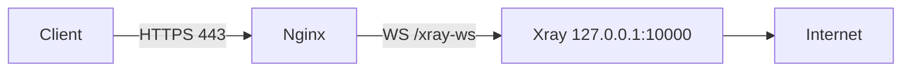
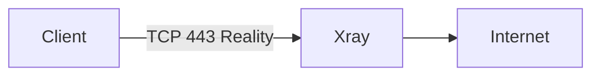
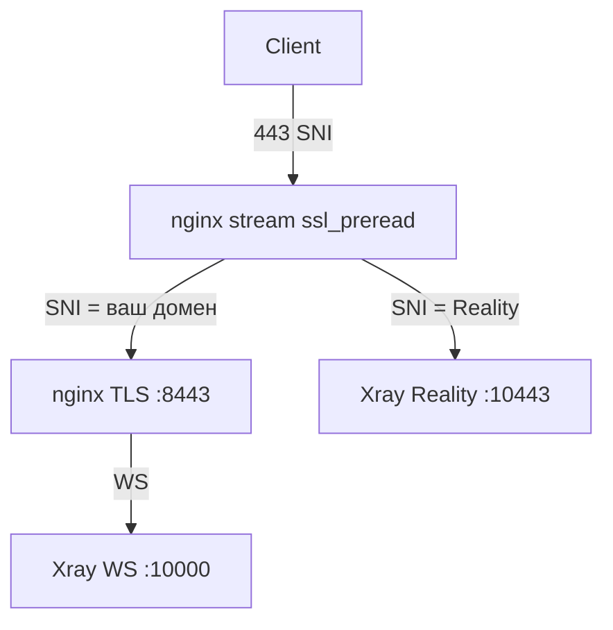

# Установка и настройка xray-cli

## Архитектура режимов

### VLESS + WebSocket + TLS (`vless-ws`)



- nginx терминирует TLS (Let's Encrypt)
- xray слушает только localhost
- На `/` — decoy-страница

### VLESS + Reality (`vless-reality`)



- xray слушает `0.0.0.0:443` напрямую
- nginx не используется
- Маскировка под выбранный SNI (например `www.microsoft.com`)

### Комбо (`combo`)



## Порты по умолчанию

| Сервис | Порт | Назначение |
|--------|------|------------|
| nginx | 443 | Публичный (WS или stream) |
| nginx internal | 8443 | TLS для домена (combo) |
| xray WS | 10000 | WebSocket inbound |
| xray Reality | 10443 / 443 | Внутренний (combo) / публичный (только Reality) |

## Флаги install.sh

| Флаг | Описание |
|------|----------|
| `--help` | Справка |
| `--dry-run` | Без изменений на системе |
| `--non-interactive` | Без вопросов |
| `--yes` | Авто-ответ «да» |
| `--reconfigure` | Пересобрать при повторном запуске |
| `--mode` | `vless-ws`, `vless-reality`, `combo` |
| `--domain` | Домен для WS |
| `--email` | Email для certbot |
| `--reality-dest` | `host:port` для Reality dest |
| `--reality-sni` | SNI для клиента |
| `--fingerprint` | `chrome` или `random` |

## Переменные окружения

| Переменная | По умолчанию | Описание |
|------------|--------------|----------|
| `LOG_LEVEL` | `INFO` | `DEBUG`, `INFO`, `WARN`, `ERROR` |
| `WS_PORT` | `10000` | Порт WebSocket inbound |
| `WS_PATH` | `/xray-ws` | Путь WebSocket |

## SSL / обновление сертификата

Сертификаты Let's Encrypt в `/etc/letsencrypt/live/<domain>/`.

Certbot renew hook: `/etc/letsencrypt/renewal-hooks/deploy/xray-cli-copy-certs.sh` — перезагружает nginx после обновления.

Проверка вручную:

```bash
sudo certbot renew --dry-run
```

## Troubleshooting

### xray не стартует

```bash
sudo xray run -test -config /usr/local/etc/xray/config.json
sudo journalctl -u xray -n 50 --no-pager
```

### nginx ошибка конфигурации

```bash
sudo nginx -t
sudo journalctl -u nginx -n 30 --no-pager
```

### DNS не совпадает

Убедитесь, что A-запись домена указывает на IP сервера. Установщик предупредит при несовпадении.

### Импорт ссылки в клиент

1. Скопируйте ссылку из `/etc/xray-cli/client-links.txt`
2. Импортируйте в v2rayN, Nekoray, Hiddify или аналог
3. Для Reality используйте ссылку `[vless-reality]`

## Добавление второго клиента вручную

1. Сгенерируйте UUID: `xray uuid`
2. Добавьте в `clients` в `/usr/local/etc/xray/config.json`
3. `sudo systemctl restart xray`
4. Соберите новую ссылку по шаблону из `lib/link-builder.sh`

## Удаление

```bash
sudo xray-cli uninstall
# Полное удаление xray-core:
# bash -c "$(curl -L https://github.com/XTLS/Xray-install/raw/main/install-release.sh)" @ remove
```
