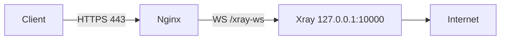
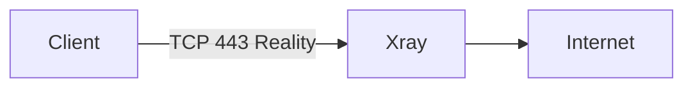
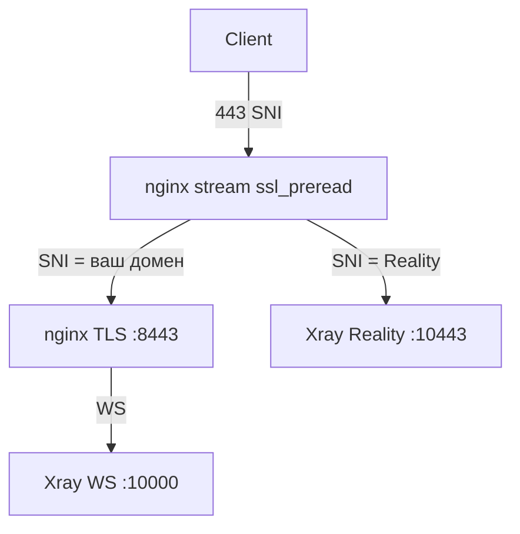

# Установка и настройка xray-cli

## Архитектура режимов

### VLESS + WebSocket + TLS (`vless-ws`)



- nginx терминирует TLS (Let's Encrypt)
- xray слушает только localhost
- На `/` — decoy-страница

### VLESS + Reality (`vless-reality`)



- xray слушает `0.0.0.0:443` напрямую
- nginx не используется
- Маскировка под выбранный SNI (например `www.microsoft.com`)
- При импорте эталонного client JSON адрес/hostname и fingerprint можно подтянуть автоматически

### Комбо (`combo`)



- `VLESS-WS` использует ваш домен как внешний адрес подключения
- `Reality` в `combo` по умолчанию тоже использует ваш домен как client `address`
- `Reality serverName` остаётся отдельным маскировочным значением

## Порты по умолчанию

| Сервис | Порт | Назначение |
|--------|------|------------|
| nginx | 443 | Публичный (WS или stream) |
| nginx internal | 8443 | TLS для домена (combo) |
| xray WS | 10000 | WebSocket inbound |
| xray Reality | 10443 / 443 | Внутренний (combo) / публичный (только Reality) |

## Флаги install.sh

| Флаг | Описание |
|------|----------|
| `--help` | Справка |
| `--dry-run` | Без изменений на системе |
| `--non-interactive` | Без вопросов |
| `--yes` | Авто-ответ «да» |
| `--reconfigure` | Пересобрать при повторном запуске |
| `--mode` | `vless-ws`, `vless-reality`, `combo` |
| `--domain` | Домен для WS |
| `--email` | Email для certbot |
| `--reality-dest` | `host:port` для Reality dest |
| `--reality-address` | Явный hostname/IP для клиентского Reality профиля |
| `--reality-sni` | SNI для клиента |
| `--fingerprint` | Любой fingerprint клиента (`chrome`, `random`, `qq`, ...) |
| `--client-uuid` | Явный UUID клиента |
| `--reality-short-id` | Явный Reality shortId |
| `--reality-reference-json` | Путь к рабочему клиентскому Reality JSON для импорта эталонных параметров |

## Импорт эталонного Reality client JSON

Если у вас уже есть рабочий клиентский конфиг, например экспорт из Nekoray / v2rayN / Hiddify, его можно использовать как эталон:

```bash
sudo ./install.sh --mode vless-reality --yes --non-interactive \
  --reality-reference-json /path/to/test.json
```

Что импортируется:

- `address`
- `port`
- `flow`
- `serverName`
- `fingerprint`
- `remarks`

Что не восстанавливается один в один:

- `privateKey` сервера в клиентском JSON отсутствует
- `UUID` и `shortId` для нового сервера продолжают генерироваться локально, если вы не задали их явно CLI-флагами
- новый сервер всегда получает свою локально сгенерированную пару `x25519`
- новый `publicKey` публикуется в `vless://` ссылке и `/etc/xray-cli/client-reality.json`
- импортированный `publicKey` хранится только как reference для сверки и диагностики

Если в эталоне нет `dest`, установщик выводит его как `${REALITY_SNI}:443`.

## Переменные окружения

| Переменная | По умолчанию | Описание |
|------------|--------------|----------|
| `LOG_LEVEL` | `INFO` | `DEBUG`, `INFO`, `WARN`, `ERROR` |
| `WS_PORT` | `10000` | Порт WebSocket inbound |
| `WS_PATH` | `/xray-ws` | Путь WebSocket |

## SSL / обновление сертификата

Сертификаты Let's Encrypt в `/etc/letsencrypt/live/<domain>/`.

Certbot renew hook: `/etc/letsencrypt/renewal-hooks/deploy/xray-cli-copy-certs.sh` — перезагружает nginx после обновления.

Проверка вручную:

```bash
sudo certbot renew --dry-run
```

## Troubleshooting

### xray не стартует

```bash
sudo xray run -test -config /usr/local/etc/xray/config.json
sudo journalctl -u xray -n 50 --no-pager
```

### `conflicting server name ... on 0.0.0.0:80, ignored`

Два `server` блока слушают порт 80 с одним `server_name`. Часто это `default` + ваш домен:

```bash
grep -rn "letim-na-mars.ru" /etc/nginx/sites-enabled/
sudo rm -f /etc/nginx/sites-enabled/default
sudo nginx -t && sudo systemctl restart nginx
```

Предупреждение не блокирует запуск, но лучше убрать дубликат.

### xray занимает порт 443 (старая установка)

Если xray был установлен раньше с `listen: 443`, nginx не сможет стартовать в режиме **vless-ws** или **combo**.

```bash
sudo systemctl stop xray
sudo ss -tlnp | grep 443          # порт должен быть свободен
sudo cp /usr/local/etc/xray/config.json /usr/local/etc/xray/config.json.bak
sudo ./install.sh --reconfigure --non-interactive --yes \
  --mode combo --domain letim-na-mars.ru --email admin@letim-na-mars.ru
sudo systemctl start nginx
sudo systemctl start xray
```

В combo xray слушает **127.0.0.1:10443** (Reality) и **127.0.0.1:10000** (WS), а **443** остаётся за nginx stream.

### `nginx.service is not active, cannot reload`

Конфиг в порядке, но сервис не запущен:

```bash
sudo systemctl start nginx
sudo systemctl enable nginx
sudo systemctl status nginx
```

### nginx ошибка конфигурации

```bash
sudo nginx -t
sudo journalctl -u nginx -n 30 --no-pager
```

### `could not build map_hash, increase map_hash_bucket_size`

В combo-режиме длинные SNI в `map` требуют увеличенного bucket — см. `/etc/nginx/streams-available/xray-cli-stream.conf`.

### `"proxy_pass" directive is not allowed here` в xray-cli-stream.conf

Stream-конфиг не должен лежать в `/etc/nginx/conf.d/` (там подключается только `http`). Правильный путь:

- `/etc/nginx/streams-available/xray-cli-stream.conf`
- symlink в `/etc/nginx/streams-enabled/`
- в `nginx.conf` снаружи `http {}`:

```nginx
stream {
    include /etc/nginx/streams-enabled/*.conf;
}
```

Удалите ошибочный файл: `sudo rm /etc/nginx/conf.d/xray-cli-stream.conf`.

Если `nginx -t` жалуется `open() ".../conf.d/xray-cli-stream.conf" failed` — в `/etc/nginx/nginx.conf` осталась старая строка `include`. Удалите её и добавьте в блок `stream`:

```nginx
include /etc/nginx/streams-enabled/*.conf;
```

Либо перезапустите установщик с `--reconfigure`.

### DNS не совпадает

Убедитесь, что A-запись домена указывает на IP сервера. Установщик предупредит при несовпадении.

### Импорт ссылки в клиент

1. Скопируйте ссылку из `/etc/xray-cli/client-links.txt`
2. Импортируйте в v2rayN, Nekoray, Hiddify или аналог
3. Для Reality используйте ссылку `[vless-reality]`
4. Если нужен JSON-формат, используйте `/etc/xray-cli/client-reality.json`

### Эталонный JSON импортировался, но сервер получился не идентичным

Это ожидаемо, если у вас был только клиентский конфиг.

- Без исходного серверного `privateKey` нельзя собрать точную копию удалённого Reality сервера.
- `xrayCli` строит паритетный сервер: сохраняет наблюдаемые клиентские параметры и выпускает новый локальный keypair.
- Проверьте `xray-cli status`: там видно, какие поля импортированы, а какие сгенерированы заново.

## Добавление второго клиента вручную

1. Сгенерируйте UUID: `xray uuid`
2. Добавьте в `clients` в `/usr/local/etc/xray/config.json`
3. `sudo systemctl restart xray`
4. Соберите новую ссылку по шаблону из `lib/link-builder.sh`

## Удаление

```bash
sudo xray-cli uninstall
# Полное удаление xray-core:
# bash -c "$(curl -L https://github.com/XTLS/Xray-install/raw/main/install-release.sh)" @ remove
```
